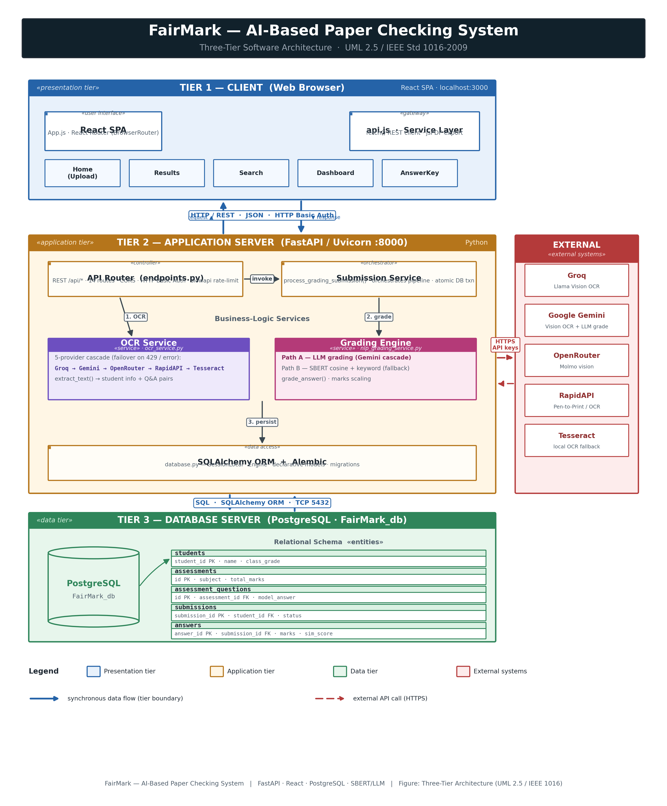
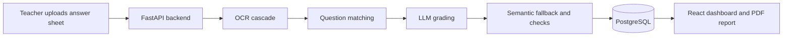

# FairMark

> An AI-assisted platform for checking handwritten exam papers, with teacher review built in.

FairMark turns a photographed or scanned answer sheet into a structured, reviewable result. It extracts answers with an OCR provider cascade, matches them against an answer key, grades them with an LLM and a local semantic fallback, and presents scores and feedback in a React dashboard.



## Why FairMark?

Manual grading is repetitive and can vary from paper to paper. FairMark helps teachers spend less time on routine marking while retaining the final decision: low-confidence OCR results and missing answer keys are flagged for manual review instead of silently guessed.

### Key capabilities

- Upload image or PDF answer sheets (JPEG, PNG, WebP, or PDF; up to 10 MB).
- Extract student details and question-answer pairs using a multi-provider OCR cascade.
- Grade answers by meaning rather than exact wording.
- Detect common quality issues such as negation, contradiction, number/unit mismatches, and keyword stuffing.
- Manage reusable answer keys through JSON or a Word template.
- Review, correct, search, and export individual results from the dashboard.

## How it works



1. FairMark validates the uploaded file and extracts question-answer pairs.
2. It finds the matching model answer in the subject question bank.
3. The primary LLM grades each response; a local SBERT-based engine is available as a fallback.
4. The backend scales marks, stores the submission, and returns per-question feedback.
5. The teacher reviews anything flagged as uncertain and can export the final report.

## Tech stack

| Layer | Technology |
| --- | --- |
| Frontend | React 18, React Router, hand-written CSS, jsPDF |
| API | FastAPI, SQLAlchemy, Alembic, Pydantic |
| Database | PostgreSQL (SQLite is suitable for local tests) |
| OCR | Groq, Gemini, OpenRouter, RapidAPI providers, Tesseract fallback |
| Grading | Gemini, Sentence-Transformers SBERT, spaCy, NLTK |

## Quick start (Windows)

### 1. Prerequisites

- Python 3.10+
- Node.js 18+
- PostgreSQL 14+ (or SQLite for local development/testing)
- At least one OCR provider API key, or a local Tesseract installation

### 2. Create local configuration

Copy the example files. Never commit the resulting `.env` files.

```powershell
Copy-Item backend/.env.example backend/.env
Copy-Item frontend/.env.example frontend/.env
```

At a minimum, set `DATABASE_URL`, `ADMIN_PASSWORD`, `REACT_APP_API_USER`, and `REACT_APP_API_PASS`. The frontend credentials must match the backend credentials. Add one or more OCR credentials for paper extraction; Gemini is optional but enables the primary LLM grader.

### 3. Run

The convenience launcher installs dependencies, applies migrations, seeds starter data, and starts both services:

```bat
run_fairmark.bat
```

Open http://localhost:3000. The API runs at http://127.0.0.1:8000/api.

For manual setup, deployment notes, environment-variable details, and troubleshooting, see [SETUP.md](SETUP.md).

## Repository guide

```text
backend/         FastAPI API, database models, migrations, and pytest suite
frontend/        React application and client-side PDF export
ocr/             Standalone OCR provider integrations and notes
grading-model/   Standalone grading-model interface and fallback engine
docs/            Architecture diagrams, requirements, and answer-key template
scripts/         Scripts used to regenerate architecture diagrams
```

Useful entry points:

- [Backend API routes](backend/app/api/endpoints.py)
- [OCR orchestration](backend/app/ocr_service.py)
- [Submission and persistence flow](backend/app/submission_service.py)
- [Grading service](backend/app/nlp_grading_service.py)
- [Frontend API client](frontend/src/services/api.js)

## Testing

From the backend directory, activate the virtual environment and run:

```powershell
pytest
```

Some NLP-dependent tests are skipped when their model assets are unavailable. See [CONTRIBUTING.md](CONTRIBUTING.md) for the expected contribution workflow.

## Documentation

- [Setup guide](SETUP.md) — local installation, configuration, and troubleshooting
- [Architecture notes](docs/architecture.md) — components, data flow, and design choices
- [API overview](docs/api.md) — authenticated endpoints and main workflows
- [Requirements](docs/requirements.md) — project requirements
- [Answer-key template](docs/templates/answer_sheet_template.docx) — Word template for uploads

## Security and privacy

Keep API keys and login credentials only in local environment files. Uploaded answer sheets may contain personal data; use approved providers, follow your institution's retention policy, and do not treat automated marks as the final academic decision without teacher review.

## Contributing

Contributions are welcome. Please read [CONTRIBUTING.md](CONTRIBUTING.md) before opening a pull request.

## License

This project is released under the [MIT License](LICENSE).
